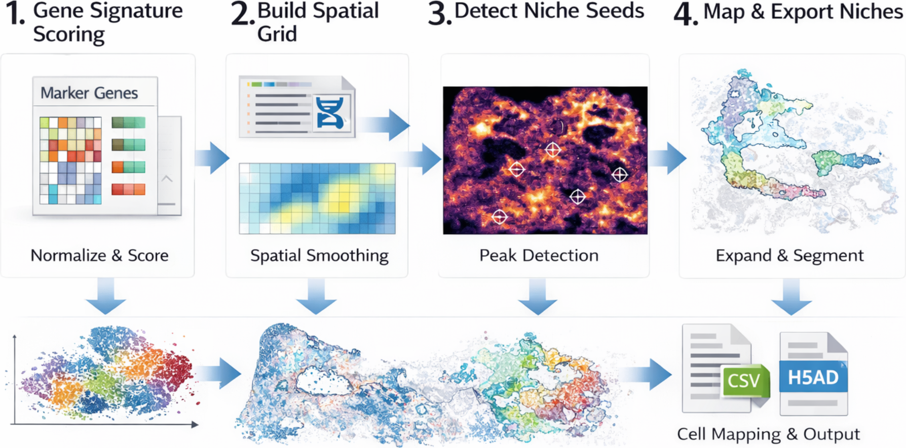

# **NicheMap: A Spatial Grid-Based Pipeline for Niche Identification in Xenium and Spatial Transcriptomics Data**


## Overview

`NicheMap` is a interpretable pipeline for identifying spatial niches from single-cell or spot-level spatial transcriptomics data. It is particularly designed for datasets with explicit spatial coordinates, such as **10x Xenium**, and combines gene signature scoring, grid-based smoothing, local peak detection, and watershed segmentation to identify coherent niche regions.




`NicheMap` consists of five connected stages: **gene signature scoring**, **spatial grid construction**, **seed detection**, **niche expansion by watershed**, and **cell-level mapping with result export**.


Using `NicheMap` you can do:

- **Calculate spatial gene signature scores** from user-defined marker gene sets.
- **Construct smoothed spatial score maps** for robust niche seed detection.
- **Identify candidate niche seeds** using heuristic local peak detection.
- **Segment niche regions** through watershed-based spatial expansion.
- **Map niche labels back to single cells** and export publication-ready figures and processed data.

## Installation

The installation was tested on a Windows workstation with Python 3.10+, Scanpy, AnnData, and standard scientific Python dependencies. `NicheMap` is CPU-friendly and does not require a GPU.

### Step 1. Create a virtual environment

Using `conda`:

```
conda create -n nichemap python=3.10
conda activate nichemap
```

Or using `venv`:

```
python -m venv nichemap
nichemap\Scripts\activate
```

### Step 2. Install dependency packages

You can install the required dependencies using:

```
pip install -r requirements.txt
```

A minimal `requirements.txt` may include:

```
numpy
pandas
matplotlib
scanpy
anndata
scipy
scikit-image
zarr
tqdm
```

### Step 3. Install NicheMap

If you are developing locally:

```
python setup.py build
python setup.py install
```

Or use editable mode:

```
pip install -e .
```

Here, the environment configuration is completed.

## Pipeline

`NicheMap` follows a five-step workflow:

### Step 1. Load Xenium data

Load the Xenium expression matrix, parse cell polygons from `cells.zarr`, compute cell centroids, and optionally merge cell annotation files.

### Step 2. Calculate gene signature score

Read a user-defined marker gene list and calculate an average expression score for each cell.

### Step 3. Build spatial grid

Project cell-level scores to a 2D spatial grid and generate a smoothed score map for peak detection.

### Step 4. Detect niche seeds and segment regions

Identify local peaks as candidate niche seeds, generate an expansion mask, and perform watershed segmentation to obtain niche regions.

### Step 5. Map niches back to cells and export results

Assign niche labels to cells based on grid position and export figures, CSV metadata, and processed `h5ad` objects.

## Quick Start

```
import sys
import os
sys.path.append(os.path.abspath("C://Users//heyi//Desktop/NicheMap-main"))
import nichemap as nm


sample_pref = "SSc_1_1_2"
base_dir = r"F:\spatial_data_lung\SSc_1_1_2_raw"
anno_file = r"F:\spatial_data_lung\ssc211_annotation_map.csv"
gene_list = r"F:\spatial_data_lung\marker_genes\ECM-gene.csv"
score_id = "ECM_score"
peak_intensity = 2.5
exp_intensity = 1.0
out_dir = rf"F:\spatial_data_lung\Xenium_Result_data\SSc_1_1_2_result\{score_id}"

os.makedirs(out_dir, exist_ok=True)

adata = nm.preprocess.load_xenium_data(
    base_dir=base_dir,
    anno_file=anno_file
)

model = nm.NicheMap(
    adata=adata,
    score_id=score_id,
    sample_prefix=sample_pref,
    out_dir=out_dir
)

final_adata = model.run(
    gene_list_csv=gene_list,
    bins=300,
    peak_intensity=peak_intensity,
    exp_intensity=exp_intensity
)
```

## Input Data Format

### Required input structure for Xenium

```
base_dir/
├── cell_feature_matrix/
│   ├── matrix.mtx.gz
│   ├── features.tsv.gz
│   ├── barcodes.tsv.gz
├── cells.zarr
```

### Optional files

- Annotation CSV with at least two columns:
  - `cell_id`
  - `annotation`
- Marker gene CSV with a gene symbol column, for example:
  - `Gene Symbol`

## Output

After running the pipeline, `NicheMap` generates:

### Figures

- Spatial score map
- Raw grid map
- Grid cell density map
- Peak detection map
- Peak positions on spatial scatter
- Candidate expansion region
- Spatial niche segmentation
- Cell-level niche assignment

### Data files

- `*.csv`: exported cell metadata with niche labels
- `*.h5ad`: processed AnnData object with niche assignments

## Key Parameters

| Parameter        | Description                                       |
| ---------------- | ------------------------------------------------- |
| `score_id`       | Name of the signature score stored in `adata.obs` |
| `bins`           | Number of bins used for spatial grid construction |
| `peak_intensity` | Threshold strength for niche seed detection       |
| `exp_intensity`  | Threshold strength for niche region expansion     |
| `sample_prefix`  | Prefix used for exported file names               |

In general:

- Larger `bins` gives finer spatial resolution but may increase noise.
- Larger `peak_intensity` gives fewer, stricter seed points.
- Larger `exp_intensity` makes niche expansion more conservative.

## Progress Display

`NicheMap` supports command-line progress display using `tqdm` during the pipeline run. This helps monitor multi-step execution, especially for large Xenium datasets.

Example progress display:

```
NicheMap pipeline:  60%|██████    | 3/5 [00:12<00:08,  4.01s/step]
```

## Tutorials

You can prepare a future wiki or tutorial page such as:

- **How to use NicheMap**
- **Tutorial : Application on Xenium lung fibrosis dataset**

## Reference and Citation

If you use `NicheMap` in your work, please cite:

```
He, Y. et al. NicheMap: A spatial grid-based pipeline for niche identification in spatial transcriptomics. (Todo)
```

If a manuscript or preprint is available, replace the placeholder citation above with the final reference.

## Notes

- `NicheMap` is mainly designed for coordinate-resolved spatial transcriptomics data.
- Xenium support is currently the primary use case.
- For large datasets, rasterized plotting is recommended to reduce output file size.
- Some optional plotting features may require extra packages such as `matplotlib-scalebar`.