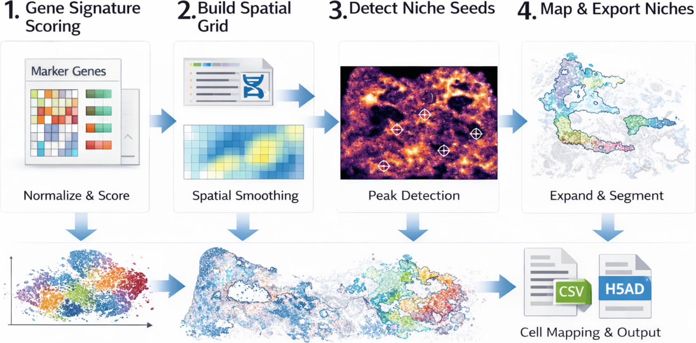

# NicheMap

[](https://nichemap-tutorials.readthedocs.io/en/latest/)

**NicheMap** is a Python toolkit for spatial niche analysis in Xenium and other
coordinate-resolved spatial transcriptomics data.

<p align="center">
  
</p>

## What It Does

NicheMap supports two complementary workflows:

- **Spatial niche identification** from marker-gene signature scores using
  grid smoothing, seed detection, watershed expansion, and cell-level niche
  assignment.
- **Cell-type neighborhood analysis** around annotated spatial structures using
  graph-hop neighborhoods, cell-type composition summaries, and spatial
  visualization.



## Installation

Install from PyPI:

```bash
pip install nichemap
```

For local development from source:

```bash
git clone https://github.com/yihe-csu/NicheMap.git
cd NicheMap
pip install -e .
```

Optional notebook and plotting extras:

```bash
pip install "nichemap[all]"
```

## Quick Start: Spatial Niche Identification

```python
from pathlib import Path

import nichemap as nm

adata = nm.preprocess.load_xenium_data(
    base_dir=r"F:\spatial_data_lung\SSc_1_1_2_raw",
    anno_file=r"F:\spatial_data_lung\ssc112_annotation_map.csv",
)

model = nm.NicheMap(
    adata=adata,
    score_id="ECM_score",
    sample_prefix="SSc_1_1_2",
    out_dir=Path("outputs/ECM_score"),
)

final_adata = model.run(
    gene_list_csv=r"F:\spatial_data_lung\marker_genes\ECM-gene.csv",
    bins=300,
    peak_intensity=1.5,
    exp_intensity=1.0,
)
```

## Quick Start: Cell-Type Neighborhood Analysis

```python
import scanpy as sc
import nichemap.neighborhood as nh

adata = sc.read_h5ad("data/SSc_1_1_2_tutorial.h5ad")

results = nh.run_cell_type_neighborhood_analysis(
    adata=adata,
    target_regions=["Airway_wall"],
    hops=[1, 2, 3],
    structure_col="structure_label",
    cell_type_col="cell_type",
    output_dir="outputs/neighborhood",
    selected_cell_types=None,
    make_plots=True,
    display_plots=True,
)
```

## Input Requirements

For the main Xenium pipeline, the raw input directory should contain:

```text
base_dir/
|-- cell_feature_matrix/
|   |-- matrix.mtx.gz
|   |-- features.tsv.gz
|   `-- barcodes.tsv.gz
`-- cells.zarr
```

For neighborhood analysis, the input `AnnData` object should contain:

- spatial coordinates in `adata.obsm["spatial"]`
- structure labels in `adata.obs`, for example `structure_label`
- cell-type labels in `adata.obs`, for example `cell_type`
- optionally, a precomputed graph in `adata.obsp["spatial_connectivities"]`

## Outputs

NicheMap exports publication-oriented figures and tables, including:

- spatial signature score maps
- grid maps and seed detection plots
- segmented niche maps and cell-level niche labels
- neighborhood cell-type proportion CSV files
- stacked bar plots, spatial topology plots, and hop-gradient trend plots

## Tutorials

- Online tutorials: https://nichemap-tutorials.readthedocs.io/en/latest/
- Detailed usage guide: [How to use NicheMap](./How%20to%20use%20NicheMap.md)
- Step-by-step Xenium analysis:
  [Tutorials/NicheMap_Lung_data_Xenium_step_by_step.py](./Tutorials/NicheMap_Lung_data_Xenium_step_by_step.py)
- Full Xenium workflow:
  [Tutorials/NicheMap_Lung_data_Xenium.py](./Tutorials/NicheMap_Lung_data_Xenium.py)
- Neighborhood analysis notebook:
  [Tutorials/NicheMap_neighborhood_tutorial.ipynb](./Tutorials/NicheMap_neighborhood_tutorial.ipynb)

## PyPI Packaging

NicheMap uses `pyproject.toml` for package metadata and build configuration.
To build and check the package locally:

```bash
python -m pip install --upgrade build twine
python -m build
python -m twine check dist/*
```

## Citation

If you use NicheMap in your work, please cite:

```text
He, Y. et al. NicheMap: a spatial grid-based pipeline for niche identification
in spatial transcriptomics. (Manuscript in preparation)
```

## License

This project is released under the MIT License. See [LICENSE](./LICENSE).
